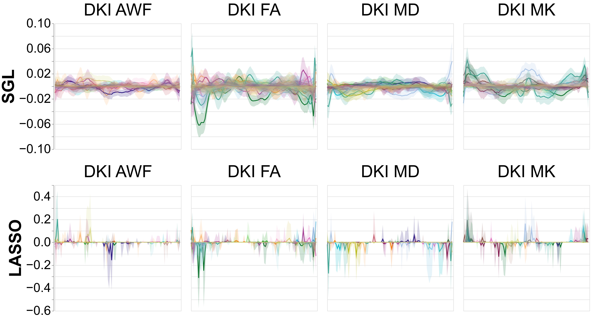

<style>
/* change poster body text */
.poster_body h1 {
    font-family: "Palatino", "URW Palladio L", "serif";
}

body {
bottom-margin: 0px;
}

/* change color of subsection headers */
.poster_body h1 {
    background-color: #b7a57a;
    border: #85754d;
    padding: 0px;
    text-align: center; 
    width:100%;
}
    
/*this gets rid of the line break with the affiliations*/
h5 br {
    display: none;
    
}

/* This controls the affiliations.*/
.poster_title h5 {
    font-family: "Palatino", "URW Palladio L", "serif";
    text-align: center;
    margin-top:-1cm;
}

    /* controls author list */
.poster_title h3 {
    font-family: "Palatino", "URW Palladio L", "serif";
    margin-top:-.51cm;
}

.title_container {
    height: 150mm; }/* found using trial and error */

</style>


<!---
This is how you do comments.
-->

```{r setup, include=FALSE}
knitr::opts_chunk$set(echo = FALSE)
```

# Background

- Diffusion MRI (dMRI) measures tissue properties of white matter, which contains long-range connections between different brain regions.
- Brain-behavior models can be used link neuroimaging features and phenotypes.
- Researchers have several options to process dMRI data into input features for brain-behavior modeling.
- Characteristics of feature sets determine which regularization methods are suitable for modeling fitting.

**Question:** How do sets of features derived from different dMRI processing methods compare in model accuracy and variability?


# Methods
- Processed into "tract profiles" (see [@Kruper2024] for processing details and to access data; 9,600 features) using [pyAFQ](https://yeatmanlab.github.io/pyAFQ/) and "local connectome fingerprint" (128,894 features) using DSI-Studio [@Yeh2016-hv] (shared by [@Rasero2021-ef]).
- Predictive models were trained using tractometry or local connectome matrices as input features and LASSO or Sparse Group LASSO regularization. 


 <div style="text-align: center; transform: translate(0px,-100px); padding: 0px;">
![Tractometry and LC processing diagrams adapted from [@Yeatman2012-lg] and [@Yeh2016-hv]. ](images/ohbm_methods1.png){#id .class width=100% height=100"}
</div>


<p style="margin-top:-3.5cm">
- Prediction targets were various cognitive phenotypes drawn from prior predictive modeling investigations[@Rasero2021-ef].
- Models implemented in `R` and trained using nested group cross-validation and boostrap resampling by family. 
- Models evaluated with and without grouped cross-validation to evaluate "leakage" of related inviduals. 
    -
    -

</p>


<!---
This ended up super fiddly because the images need to be manually placed using
style tags to avoid having large whitespaces, which in turn screws up the whole block.

Any image resizing means adding more or less whitespaces, found
using trial and error.
-->

# Acknowledgements
<div style="transform: translate(0px,-95px); height: 30%; padding: 0; float: left" >
   
</div> 
Data were provided by the Human Connectome Project, WU-Minn Consortium.


<style> 
.ref_title { position:absolute}
</style>
# References {#identifier .ref_title}


<div id="refs"></div>


# Placeholder


<p style="margin-top:15cm">
# Results
</p>


<p style="margin-top:-1cm">
{#id .class width=100% height=100%}
**Model accuracies for behavioral phenotypes.** All models, regardless of regularization method or feature set performed equivalently. These $R^2$ values are in line with previous literature evaluating brain-behavior predictive models.[@Rasero2021-ef]
</p>
<p style="margin-top:-1cm">
- Despite concerns about "leakage", there was no difference between model accuracies with and without grouping by family for cross-validation splits for all phenotypes.
</p>


{#id .class width=100% height=100% }
**"Age" prediction model weights across tracts for SGL and LASSO.** Solid lines show the mean model weight across bootstraps for every tract, across every node. The shaded areas show the 95\% confidence intervals of the model weights. Note the reduced y-axis range for SGL. This pattern was consistent across phenotypes.


<p style="margin-top:-1cm">
# Conclusions
</p>
<p style="margin-top:-1cm">
- Tractometry contains equivalent predictive information as compared to local connectome, with much fewer features.
- Utilizing a variety of regularization methods and feature engineering can maximize interpretability of models through more stable model weights.
</p>
